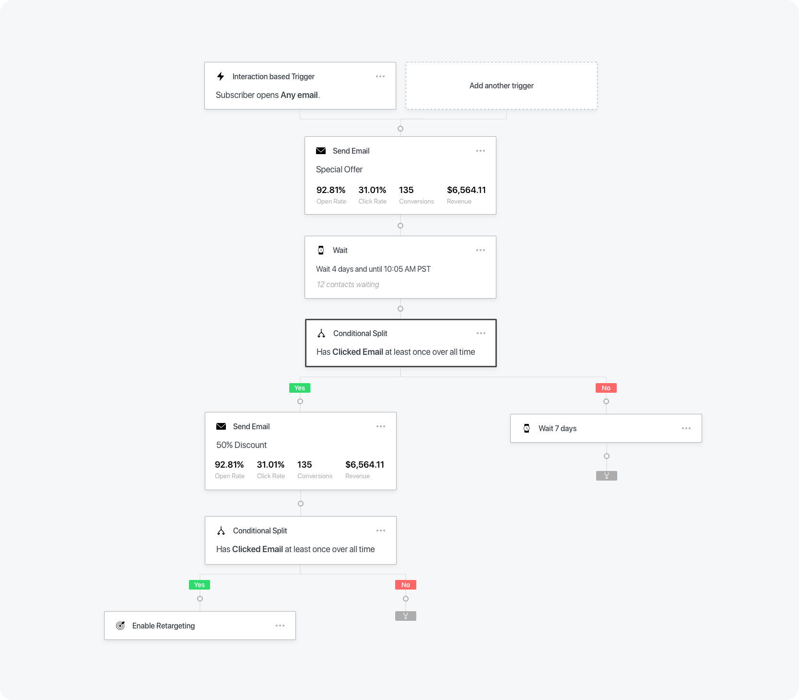
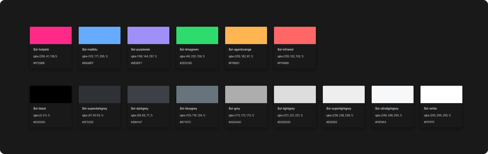

{: .post-image .img-120 .zoom-image}

A sample automation configuration.
{: .post-caption}

The project was much more than a redesign of the automation feature. Rather, it created a new framework and component library that was used to redesign the entire platform.
{: .post-paragraph-embedded-last}

{: .post-image .img-120 .zoom-image}

Updated and consolidated color palette.
{: .post-caption}

A new style guide was implemented during feature development that went on to supersede the existing brand and UI styles.
{: .post-paragraph-embedded-last}

