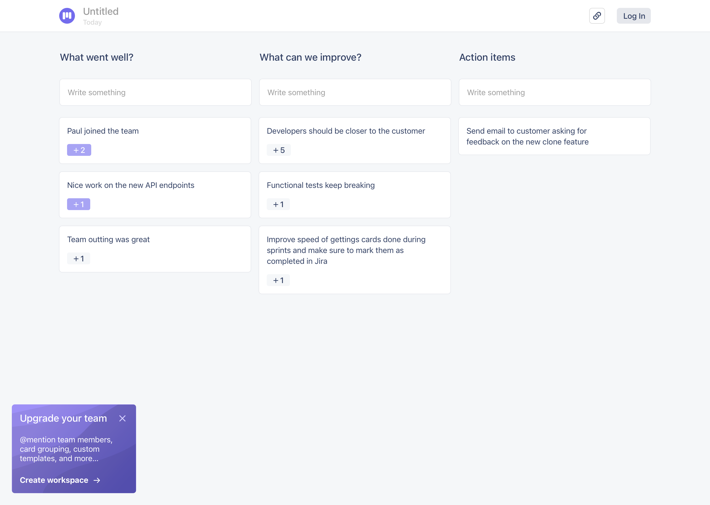

I started 2020 with the goal of attempting to build a web app using [VueJS](https://vuejs.org/) and [Firebase](https://firebase.google.com/). I have always felt that good product designers should have an essential understanding of how designs are implemented. So I thought it would be fun to try building a micro SaaS product.

At the time, the engineering team at Raken needed a tool for agile retrospectives. The tool needed to bring people together---whether or not they were in the same room or country.

My initial requirements were simple. <mark>The app needed to work in real-time and on any device.</mark>

{: .post-image .img-120 .mt .mb .zoom-image }

The first iteration of the app gave users the ability to create public retros---anybody with the [link](https://ezretro.com/E0gysdEpPrxyO685zjQx) can contribute. It also provided the ability to vote on issues that other users wrote.

The next iteration added features that required authentication:

- Team management
- @mention teammates
- Admins controls

Give it a try at [ezretro.com](https://ezretro.com).