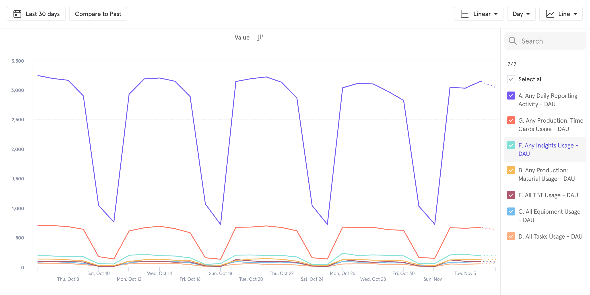
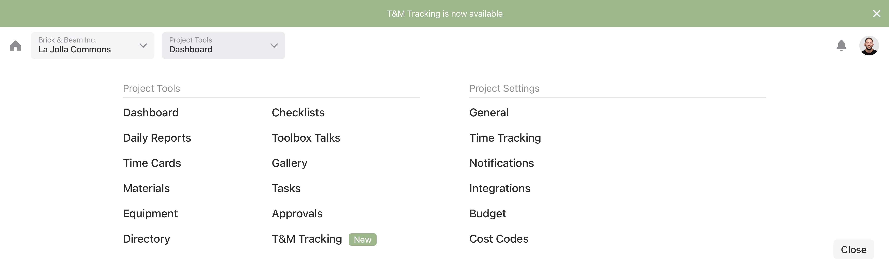
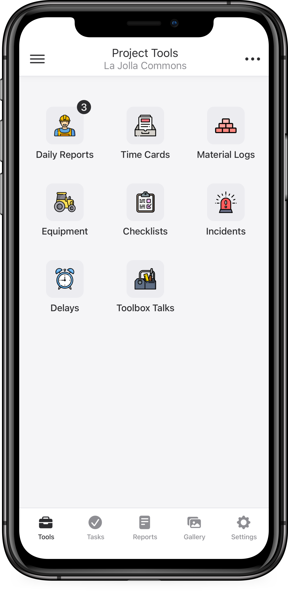

<mark>When I first joined Raken, features in our web application were painfully fragmented.</mark>

Through customer feedback and event tracking, the team had come to learn that existing features beyond our daily reporting tools were not being adopted by our users.

Engineering teams were spending months on new features only to find that adoption was incredibly low even though these were highly asked-for features.

This was partially symptomatic of where Raken found product market fit initially: people knew us as a daily reporting solution and nothing more.
{: .post-paragraph-embedded-last}

{:.img-120 .mb .mt .zoom-image}

From production tracking, timecards, and safety talks, to checklists. Users had to navigate away from the daily report in order to discover them.

My role was to work with stakeholders across the organization in order to understand how changes to the navigation might affect operations and to envision how we might improve the experience.

We knew from research that user’s who were taught about our extended features were much more likely to continue using them after their training period ended. We also knew that the needs of companies using these features was highly variable; there was no single flow that could work for everyone.

All of this highlighted the fundamental problem with how Raken’s information architecture was set up: having a highly nested navigation hierarchy meant that user’s rarely ventured out of the features that they were familiar with.
{: .post-paragraph-embedded-last}

<mark>We asked: what would happen if we consolidated the project feature navigation into a single menu?</mark>

<video autoplay loop width="100%">
  <source src="../assets/img/raken/information-architecture.mp4" type="video/mp4">
  <source src="../assets/img/raken/information-architecture.webm" type="video/webm">
  
Your browser doesn't support HTML5 video. Here is
     a <a href="../assets/img/raken/information-architecture.mp4">link to the video</a> instead.

</video>{:.img-post .mb .mt}

Due to the nature of the application, there was a need to distinguish between Company level and Project level features. This duality presented an opportunity to organize features according to whether or not the user is inside a project.
{: .post-paragraph-embedded-last}

<video autoplay loop width="100%">
  <source src="../assets/img/raken/project-and-company.mp4" type="video/mp4">
  <source src="../assets/img/raken/project-and-company.webm" type="video/webm">
  
Your browser doesn't support HTML5 video. Here is
     a <a href="../assets/img/raken/project-and-company.mp4">link to the video</a> instead.

</video>{:.img-120 .mb .mt}

In order to flatten the navigation we needed to surface features and settings that had long been buried deep within settings. Not only did the change create more visibility for these features but it also provided an opportunity for new feature announcements and upgrade prompts when the user was on a basic plan. Check out the [Web](https://www.sketch.com/s/99011ff7-74b8-40fe-9053-45e867580ab6/v/ZWj8j5/a/kwMv79/play) experience.
{: .post-paragraph-embedded-last}

{:.img-120 .mt .mb .zoom-image}

Even though this project was primarily an improvement to the Raken web experience, our mobile apps also needed to be updated to follow the same patterns.

Since Raken’s native mobile apps act as a bridge between office admins and workers out in the field, we needed to make sure that the new architecture would continue to be intuitive for those users while matching the new pattern. 
{: .post-paragraph-embedded-last}

{:.img-50 .mt .mb .zoom-image}

I needed a layout that was straight-forward and easy to understand: I landed on the layout above because it offered simplicity and the flexibility to add or remove features based on plan type, user type, or company customization.

Early signals have been promising: internal stakeholders and customers like being able to navigate their project settings all from a single menu. For our users, having a reliable app to perform their work activities is a must and though the app has confusing layouts and poor interactions, they had become accustomed to them. Our strategy is to slowly release the redesign in chunks.

This project is ongoing and slated to be completed June 2021.
