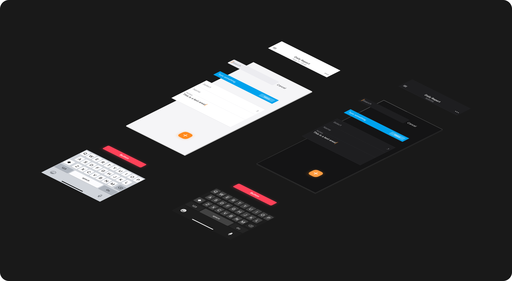
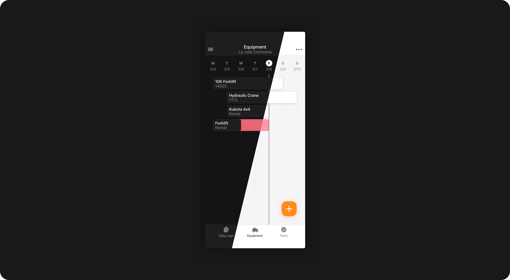

{: .post-image .img-120}

Symbol nesting allows for components to be quickly updated across all feature designs.
{: .post-caption}

Using atomic design principles ensures that every component in the library has all the necessary overrides as self contained symbols. 
{: .post-paragraph-embedded-last}

{: .post-image .img-120}

The design system will support the new iOS 13 dark mode.
{: .post-caption}

One of the biggest challenges was optimizing the library to make it easy for designers to switch between different states of a component quickly. The taxonomy of the naming conventions was designed to make the last property the most useful depending on the component.
{: .post-paragraph-embedded-last}